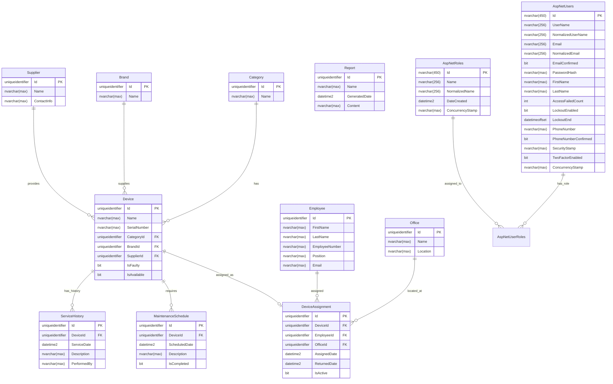

# Inventory Management System - Database Documentation

## Overview

This documentation provides comprehensive information about the database structure, relationships, and operations for the Inventory Management System. The system is built using Entity Framework Core with SQL Server as the database provider.

## Database Architecture

The database follows a relational model with proper normalization and foreign key relationships to ensure data integrity. The system manages inventory items, their assignments to employees, maintenance schedules, and service history.

## Entity Relationship Diagram (ERD)

## Key Features

1. **Device Management**: Track inventory items with categories, brands, and suppliers
2. **Assignment Tracking**: Monitor device assignments to employees and offices
3. **Maintenance Scheduling**: Schedule and track device maintenance
4. **Service History**: Maintain complete service records for all devices
5. **User Management**: ASP.NET Core Identity integration for authentication and authorization
6. **Reporting**: Generate reports for inventory analysis

## Database Characteristics

- **Database Engine**: SQL Server
- **ORM**: Entity Framework Core 8.0.5
- **Primary Keys**: GUID (uniqueidentifier) for all entities
- **Identity Integration**: ASP.NET Core Identity tables for user management
- **Relationships**: Proper foreign key constraints with appropriate cascade behaviors
- **Indexing**: Strategic indexes on foreign key columns for performance optimization

## Documentation Structure

- **[Table Definitions](./schemas/table-definitions.md)**: Detailed table structures and constraints
- **[Relationships & Constraints](./schemas/relationships.md)**: Foreign key relationships and data integrity rules
- **[Data Dictionary](./schemas/data-dictionary.md)**: Complete field descriptions and data types
- **[Sample Queries](./queries/)**: Common database operations and examples
- **[Setup Instructions](./setup/)**: Database installation and configuration guide
- **[Index Analysis](./schemas/indexes.md)**: Database indexes and performance considerations

## Quick Reference

### Main Tables
- `Devices` - Central inventory table
- `Categories` - Device categorization
- `Brands` - Device manufacturers
- `Suppliers` - Vendor information
- `Employees` - Staff management
- `Offices` - Location management
- `DeviceAssignments` - Device allocation tracking
- `MaintenanceSchedules` - Preventive maintenance
- `ServiceHistories` - Repair and service records

### Identity Tables
- `AspNetUsers` - User accounts
- `AspNetRoles` - Role definitions
- `AspNetUserRoles` - User-role assignments

## Getting Started

For database setup and installation instructions, please refer to the [Setup Guide](./setup/installation.md).