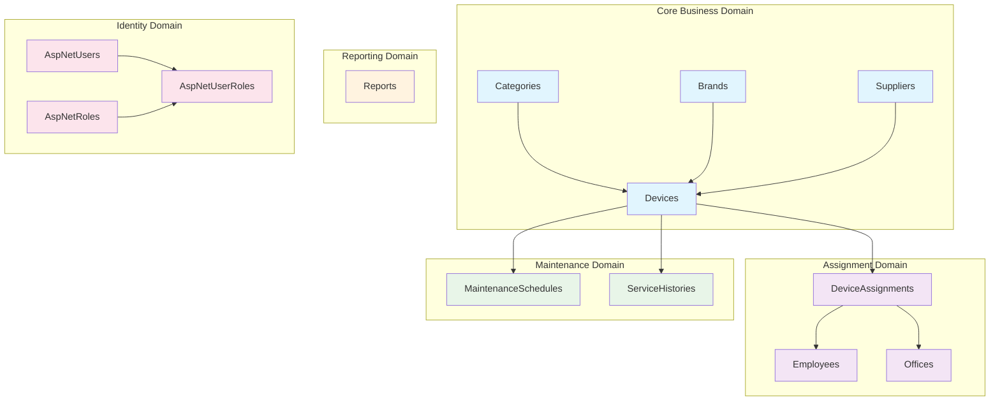
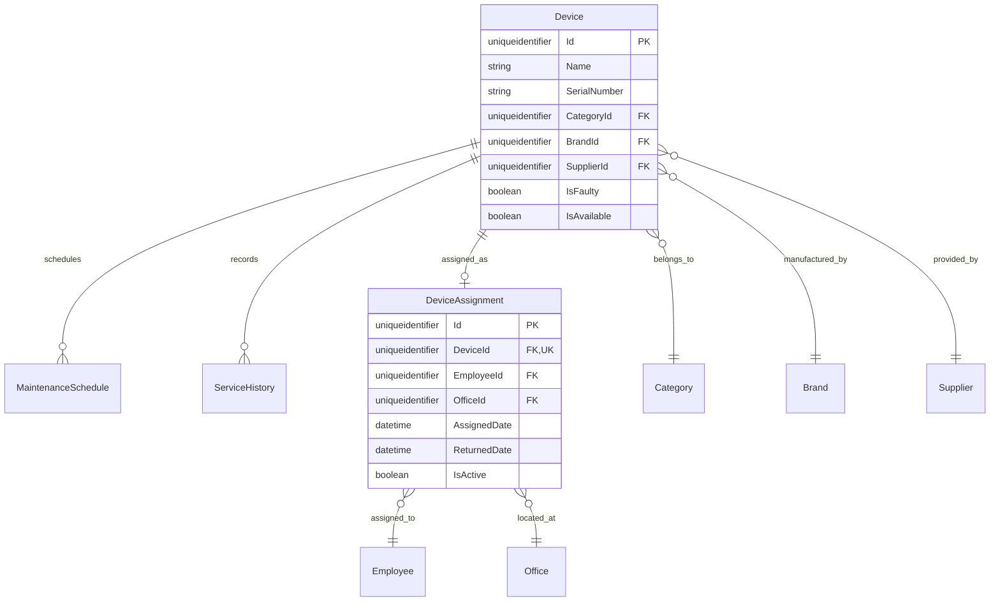
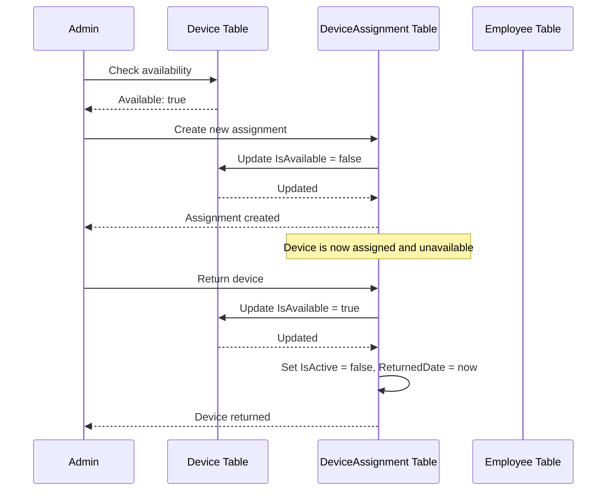
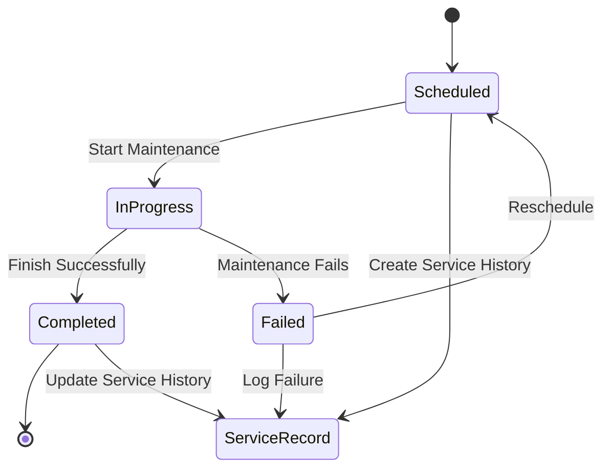
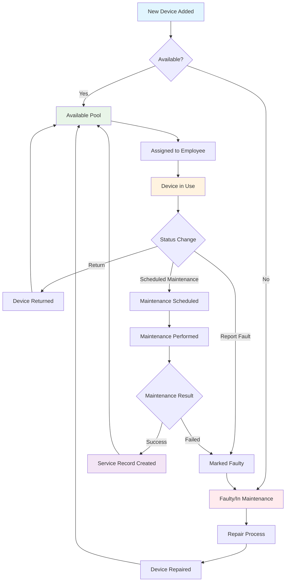
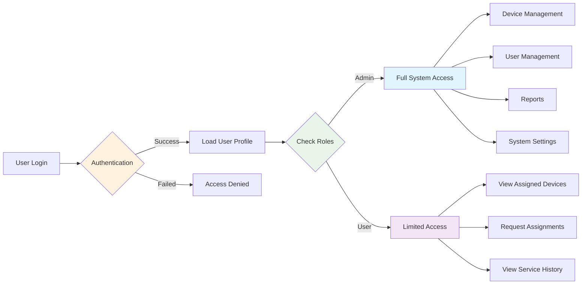

# Database Schema Overview

This document provides a visual overview of the Inventory Management System database schema with detailed explanations of the relationships and data flow.

## High-Level Architecture

The database follows a domain-driven design pattern with clear separation of concerns:

## Detailed Entity Relationships

### Device-Centric View

### Assignment Flow Diagram

### Maintenance Workflow

## Data Flow Patterns

### Device Lifecycle

### User Access Flow

## Physical Database Layout

### Table Distribution

| Schema | Table | Primary Key | Foreign Keys | Indexes |
|--------|-------|-------------|--------------|---------|
| dbo | Categories | Id | - | PK |
| dbo | Brands | Id | - | PK |
| dbo | Suppliers | Id | - | PK |
| dbo | Employees | Id | - | PK |
| dbo | Offices | Id | - | PK |
| dbo | Devices | Id | CategoryId, BrandId, SupplierId | PK, FKx3 |
| dbo | DeviceAssignments | Id | DeviceId, EmployeeId, OfficeId | PK, UK, FKx3 |
| dbo | MaintenanceSchedules | Id | DeviceId | PK, FK |
| dbo | ServiceHistories | Id | DeviceId | PK, FK |
| dbo | Reports | Id | - | PK |
| dbo | AspNetUsers | Id | - | PK, UserName, Email |
| dbo | AspNetRoles | Id | - | PK, RoleName |
| dbo | AspNetUserRoles | UserId, RoleId | UserId, RoleId | PK, FKx2 |
| dbo | AspNetUserClaims | Id | UserId | PK, FK |
| dbo | AspNetUserLogins | LoginProvider, ProviderKey | UserId | PK, FK |
| dbo | AspNetUserTokens | UserId, LoginProvider, Name | UserId | PK, FK |
| dbo | AspNetRoleClaims | Id | RoleId | PK, FK |

### Data Volume Estimates

| Table | Expected Records | Record Size | Total Size |
|-------|------------------|-------------|------------|
| Categories | 10-50 | 100 bytes | < 1 MB |
| Brands | 20-100 | 100 bytes | < 1 MB |
| Suppliers | 10-50 | 200 bytes | < 1 MB |
| Employees | 100-1000 | 500 bytes | < 1 MB |
| Offices | 5-50 | 200 bytes | < 1 MB |
| Devices | 1000-10000 | 1 KB | 1-10 MB |
| DeviceAssignments | 5000-50000 | 1 KB | 5-50 MB |
| MaintenanceSchedules | 2000-20000 | 1 KB | 2-20 MB |
| ServiceHistories | 3000-30000 | 1 KB | 3-30 MB |
| Reports | 100-1000 | 10 KB | 1-10 MB |
| AspNetUsers | 100-1000 | 1 KB | < 1 MB |
| AspNetRoles | 2-10 | 100 bytes | < 1 MB |
| Other Identity Tables | 500-5000 | 500 bytes | < 5 MB |

## Performance Considerations

### Hot Tables (High Activity)
1. **Devices** - Frequent reads for availability checks
2. **DeviceAssignments** - High read/write for assignment tracking
3. **AspNetUsers** - Frequent authentication checks

### Warm Tables (Medium Activity)
1. **MaintenanceSchedules** - Daily maintenance checks
2. **ServiceHistories** - Service record lookups
3. **Reports** - Periodic report generation

### Cold Tables (Low Activity)
1. **Categories, Brands, Suppliers** - Reference data
2. **Employees, Offices** - HR data updates
3. **AspNetRoles** - Rare role changes

### Query Patterns

#### Most Common Queries
1. Device availability lookup
2. Current assignments by employee
3. Maintenance schedule by date
4. Service history by device
5. User authentication

#### Report Queries
1. Inventory summary by category
2. Device utilization reports
3. Assignment duration analysis
4. Maintenance compliance reports
5. User activity reports

## Security Model

### Access Control Matrix

| Role | Read | Write | Delete | Admin |
|------|------|-------|--------|-------|
| Admin | All | All | All | All |
| Manager | All | Limited | Limited | Limited |
| User | Personal | Personal | None | None |
| Auditor | Read | None | None | None |

### Data Classification

| Classification | Tables | Access Level |
|----------------|--------|--------------|
| Public | Categories, Brands, Suppliers | Read |
| Internal | Devices, Employees, Offices | Role-based |
| Confidential | Assignments, Service History | Restricted |
| Sensitive | User Credentials, Authentication | Admin Only |

## Integration Points

### External Systems
1. **HR System** - Employee data synchronization
2. **Procurement System** - Supplier and purchase information
3. **Asset Management** - Financial asset tracking
4. **Help Desk System** - Service request integration

### API Interfaces
1. **REST API** - Device management operations
2. **GraphQL** - Flexible reporting queries
3. **SOAP** - Legacy system integration
4. **OData** - Advanced filtering and querying

## Scalability Considerations

### Vertical Scaling
- Increase server CPU, RAM, and storage
- Optimize existing queries and indexes
- Implement caching strategies

### Horizontal Scaling
- Read replicas for reporting
- Database sharding by department/location
- Partitioning large tables by date

### Archive Strategy
- Archive completed assignments older than 5 years
- Archive service history older than 7 years
- Maintain current 3 years of data online

This schema overview provides a comprehensive understanding of the database structure, relationships, and operational patterns to support effective system management and future enhancements.