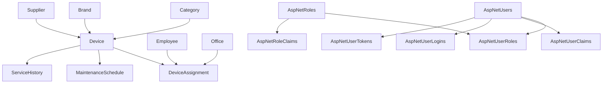

# Database Relationships & Constraints

This document describes the relationships between tables and the constraints that ensure data integrity in the Inventory Management System.

## Relationship Overview

The database follows a well-structured relational design with proper foreign key relationships and cascade behaviors. The central entity is `Devices`, which connects to most other tables.

## Entity Relationship Summary



## Business Entity Relationships

### Device-Centric Relationships

#### Device → Category (Many-to-One)
- **Relationship**: Many Devices belong to one Category
- **Foreign Key**: `Devices.CategoryId` → `Categories.Id`
- **Cardinality**: Many-to-One
- **Delete Behavior**: CASCADE (Deleting a category deletes associated devices)
- **Purpose**: Classify devices into categories

#### Device → Brand (Many-to-One)
- **Relationship**: Many Devices belong to one Brand
- **Foreign Key**: `Devices.BrandId` → `Brands.Id`
- **Cardinality**: Many-to-One
- **Delete Behavior**: CASCADE (Deleting a brand deletes associated devices)
- **Purpose**: Track device manufacturers

#### Device → Supplier (Many-to-One)
- **Relationship**: Many Devices come from one Supplier
- **Foreign Key**: `Devices.SupplierId` → `Suppliers.Id`
- **Cardinality**: Many-to-One
- **Delete Behavior**: CASCADE (Deleting a supplier deletes associated devices)
- **Purpose**: Track device vendors

#### Device ↔ DeviceAssignment (One-to-One)
- **Relationship**: One Device has at most one active DeviceAssignment
- **Foreign Key**: `DeviceAssignments.DeviceId` → `Devices.Id`
- **Cardinality**: One-to-One
- **Delete Behavior**: CASCADE (Deleting a device deletes its assignment)
- **Constraint**: UNIQUE on `DeviceAssignments.DeviceId`
- **Purpose**: Track current device assignment status

#### Device → MaintenanceSchedule (One-to-Many)
- **Relationship**: One Device can have many MaintenanceSchedules
- **Foreign Key**: `MaintenanceSchedules.DeviceId` → `Devices.Id`
- **Cardinality**: One-to-Many
- **Delete Behavior**: CASCADE (Deleting a device deletes its maintenance schedules)
- **Purpose**: Schedule preventive maintenance

#### Device → ServiceHistory (One-to-Many)
- **Relationship**: One Device can have many ServiceHistory records
- **Foreign Key**: `ServiceHistories.DeviceId` → `Devices.Id`
- **Cardinality**: One-to-Many
- **Delete Behavior**: CASCADE (Deleting a device deletes its service history)
- **Purpose**: Maintain complete service records

### Assignment Relationships

#### Employee ↔ DeviceAssignment (One-to-Many)
- **Relationship**: One Employee can have many DeviceAssignments
- **Foreign Key**: `DeviceAssignments.EmployeeId` → `Employees.Id`
- **Cardinality**: One-to-Many
- **Delete Behavior**: RESTRICT (Cannot delete employee with active assignments)
- **Nullable**: EmployeeId can be NULL (unassigned devices)
- **Purpose**: Track which employee has which devices

#### Office ↔ DeviceAssignment (One-to-Many)
- **Relationship**: One Office can have many DeviceAssignments
- **Foreign Key**: `DeviceAssignments.OfficeId` → `Offices.Id`
- **Cardinality**: One-to-Many
- **Delete Behavior**: RESTRICT (Cannot delete office with active assignments)
- **Nullable**: OfficeId can be NULL (devices not assigned to specific office)
- **Purpose**: Track device locations

## ASP.NET Core Identity Relationships

### User Management

#### AspNetUsers ↔ AspNetUserRoles (Many-to-Many)
- **Relationship**: Users can have multiple roles through AspNetUserRoles
- **Junction Table**: AspNetUserRoles
- **Foreign Keys**: 
  - `AspNetUserRoles.UserId` → `AspNetUsers.Id` (CASCADE)
  - `AspNetUserRoles.RoleId` → `AspNetRoles.Id` (CASCADE)
- **Cardinality**: Many-to-Many
- **Purpose**: Role-based authorization

#### AspNetUsers → AspNetUserClaims (One-to-Many)
- **Relationship**: One User can have many claims
- **Foreign Key**: `AspNetUserClaims.UserId` → `AspNetUsers.Id`
- **Cardinality**: One-to-Many
- **Delete Behavior**: CASCADE
- **Purpose**: Store user-specific claims

#### AspNetUsers → AspNetUserLogins (One-to-Many)
- **Relationship**: One User can have many external logins
- **Foreign Key**: `AspNetUserLogins.UserId` → `AspNetUsers.Id`
- **Cardinality**: One-to-Many
- **Delete Behavior**: CASCADE
- **Purpose**: External authentication providers

#### AspNetUsers → AspNetUserTokens (One-to-Many)
- **Relationship**: One User can have many authentication tokens
- **Foreign Key**: `AspNetUserTokens.UserId` → `AspNetUsers.Id`
- **Cardinality**: One-to-Many
- **Delete Behavior**: CASCADE
- **Purpose**: Token-based authentication

### Role Management

#### AspNetRoles → AspNetRoleClaims (One-to-Many)
- **Relationship**: One Role can have many claims
- **Foreign Key**: `AspNetRoleClaims.RoleId` → `AspNetRoles.Id`
- **Cardinality**: One-to-Many
- **Delete Behavior**: CASCADE
- **Purpose**: Store role-specific claims

## Constraint Types and Behaviors

### Primary Key Constraints

All tables use GUID-based primary keys (except Identity tables that use strings):

```sql
-- Example: Devices table
CONSTRAINT PK_Devices PRIMARY KEY (Id)
```

### Foreign Key Constraints

#### Cascade Delete Behavior
Used for dependent relationships where child records should be deleted when parent is removed:

- `Devices.CategoryId` → `Categories.Id`
- `Devices.BrandId` → `Brands.Id`
- `Devices.SupplierId` → `Suppliers.Id`
- `DeviceAssignments.DeviceId` → `Devices.Id`
- `MaintenanceSchedules.DeviceId` → `Devices.Id`
- `ServiceHistories.DeviceId` → `Devices.Id`
- All Identity table relationships

#### Restrict Delete Behavior
Used for references where parent deletion should be prevented if children exist:

- `DeviceAssignments.EmployeeId` → `Employees.Id`
- `DeviceAssignments.OfficeId` → `Offices.Id`

### Unique Constraints

#### DeviceAssignment Uniqueness
Ensures each device can have only one active assignment:

```sql
CONSTRAINT UQ_DeviceAssignments_DeviceId UNIQUE (DeviceId)
```

#### ASP.NET Core Identity Constraints
- `AspNetUsers.NormalizedUserName` - Ensures unique usernames
- `AspNetRoles.NormalizedName` - Ensures unique role names

### Check Constraints

Implicit constraints through data types:
- `bit` fields ensure boolean values (0 or 1)
- `datetime2` ensures valid date/time values
- `uniqueidentifier` ensures valid GUID format

## Data Integrity Rules

### Business Rules

1. **Device Assignment Integrity**
   - A device can only be assigned to one employee at a time
   - Assignment must be marked as inactive when returned
   - Return date must be after assignment date

2. **Device Status Consistency**
   - `IsAvailable` must be false when device has active assignment
   - `IsFaulty` devices should not be assignable

3. **Relationship Validity**
   - All foreign key references must exist
   - Circular references are prevented by proper cascade behaviors

### Referential Integrity

The database enforces referential integrity through:

1. **Foreign Key Constraints**: Prevent orphaned records
2. **Cascade Behaviors**: Automatically handle dependent data
3. **Unique Constraints**: Prevent duplicate assignments
4. **Not Null Constraints**: Ensure required relationships

## Performance Considerations

### Indexing Strategy

1. **Primary Key Indexes**: Automatically created on all primary keys
2. **Foreign Key Indexes**: Created on all foreign key columns for join performance
3. **Unique Indexes**: Enforced on business constraints
4. **Identity Indexes**: ASP.NET Core Identity specific indexes

### Query Optimization

The relationship structure supports efficient queries for:

- Device availability and status
- Assignment history and current assignments
- Maintenance schedules and service history
- User authorization and claims

## Cascade Deletion Impact

### High Impact Cascades
- **Deleting Categories**: Removes all devices in that category
- **Deleting Brands**: Removes all devices from that brand
- **Deleting Suppliers**: Removes all devices from that supplier

### Safe Cascades
- **Deleting Devices**: Removes related assignments, maintenance, and service records
- **Deleting Users**: Removes all authentication data and role assignments

**Warning**: Exercise caution when deleting parent entities with cascade delete behavior.

## Relationship Diagram Summary

The database structure ensures:

- **Data Integrity**: Through proper foreign key constraints
- **Business Logic Enforcement**: Through unique constraints and cascade behaviors
- **Performance**: Through strategic indexing
- **Flexibility**: Through nullable relationships where appropriate
- **Security**: Through ASP.NET Core Identity integration

This well-designed relational structure supports all inventory management operations while maintaining data consistency and performance.